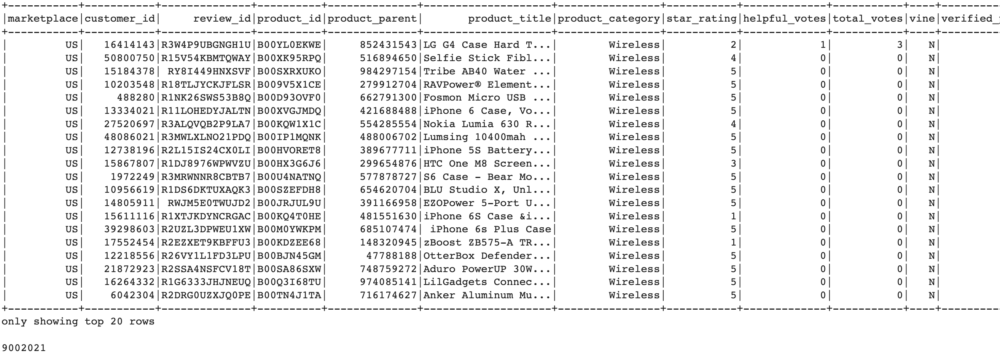

# Overview of the analysis: 
Publishers to receive reviews for their products. Companies like SellBy pay a small fee to Amazon and provide products to Amazon Vine members, who are then required to publish a review.

Analyzing Amazon reviews written by the members of the paid Amazon Vine program has been given to me to work on.

# Results: 

## Total number of wireless Amazon reviews -> 9,002,021
## All Vine reviews are -> 17,481
## Amazon Vine reviews with 5 stars -> 6,522
## Amazon non-Vine reviews with 5 stars -> 4,818,203
## Percentage of Vine reviews with 5 stars -> 37%
## Percentage of non-Vine reviews with 5 stars -> 53%

***
## Amazon Vine reviews with 4 starts -> 6,511
## Amazon Vine reviews with 3 stars -> 2,886
## Percentage of Vine reviews with 4 stars -> 37%
## Percentage of Vine reviews with 3 starts -> 16%

 

## Summary: 
For the wireless Amazon reviews, dataset is 9,002,021. Though the Amazon Vine reviews is a small part of all the reviews. Out of 17,481 nearly 37% of the reviews are with 5 stars. The other review group with 5 stars is non-Vine, it is nearly 53%. Vine reviews also include less than 5 stars as well. 4 star reveiws are 37% and 3 star reviews are 16%. Based on non-Vine vs Vine member reviews, it seems like   

